# ML4641_Robotics_Project

Dataset:
https://www.kaggle.com/datasets/samehraouf/fault-detection-in-hexapod-robot-joints-dataset/data

## Introduction

Robotic systems must maintain high reliability and safety. Joint or actuator failures in robotics cause great disruptions, and detecting, classifying, and isolating faults in robotic subsystems in real time is critical. Fault detection and diagnosis (FDD) in robotics has been studied from model-based and data-driven perspectives. In model-based approaches, observers, parity checks, and residual generation techniques detect deviation from expected dynamics. In data-driven approaches, sensor and control signals are classified or regressed by machine learning models.

### Dataset

We will use the "Fault Detection in Hexapod Robot Joints” dataset from Kaggle [3]. This dataset provides time-series readings from hexapod robot joints under various fault conditions including offset error, gain error, and combined faults. Features include pose and slopes defined by different axes. The dataset is labeled by fault class making it supervised. We aim to augment this dataset with MuJoCo Simulations and Georgia Tech’s Robotarium creating similar conditions to the ones in the Hexapod Robot Joints [4, 5].

### Background

Recent data-driven robotic optimization works include Two-States Random Forest (TSRF) algorithm applied to hexapod robot join fault detection [1]. By layering two random forest classifiers and using class-probability vectors from the first stage as meta-features for the second, they claim 99.7% accuracy over baseline random forest models. Another approach applied backpropagation neural networks to robotic fault diagnosis, exploring how different error magnitudes and sampling frequencies influence accuracy [2]. They report a diagnostic accuracy of up to 99.17% in simulation.

## Problem Definition

From these works, several themes emerge. First, faults often include constant offset, gain error, stuck or drift behavior in sensors or actuators, and occasional abrupt failures. Second, real-world systems have measurement noise, so robustness is critical. Third, distinguishing which joint or subsystem is faulty (sensor vs. actuator) is harder than simple fault detection.

Given sensor and actuator readings from hexapod robot joints, the goal is detecting and classifying faults. We plan to benchmark several models, compare their performance, and analyze feature importance, misclassifications, and robustness to noise.

We’re tackling this due to its practical relevance, extensions to other research fields, and potential novelty. Fault detection in robotic joints is crucial for maintaining uptime, safety, and reliability. Even subtle faults (sensor drift or gain error) degrade performance. The hexapod is suitable for testing with multiple joints. Analyzing this dataset might show certain features and methods yield better diagnostic accuracy providing novel, generalizable insights into fault detection.

## Methods

### Data Preprocessing:

Our data preprocessing pipeline consists of three main steps implemented in `Data Cleaning.py`:

1. **Missing Value Imputation**: We implemented K-Nearest Neighbors (KNN) imputation with 3 neighbors to replace NaN entries with values estimated from nearby samples. This was done to ensure missing data points are filled in such a way that the local structure of data was maintained.

2. **Outlier Removal**: We computed the Z-scores of each feature and removed data points that had an absolute Z-score more than 3 standard deviations from the mean. This got rid of outliers that could negatively impact model performance.

3. **Feature Scaling**: We applied a StandardScaler that normalized all the features to have zero mean and a variance of one. This was done to ensure each features contributed equally to the model regardless of its original scale.

The preprocessing reduced our dataset from the original size to a cleaned version with no missing values and improved data quality for machine learning analysis.

### ML Algorithms:

**Current Implementation**

We implemened a logistic regression as our classification model. This was done using Sci-kit learn's LogisticRegression model with multinomial classification, L-BFGS solver, regularization parameter C=1

The logistic regression model analyzes hexapod pose and slope data to determine feature combinations that result in fault joints. This approach allowed us to identify the most important features for fault detection and provided interpretable coefficients for each class.

The Support Vector Machine (SVM) model works by finding a hyperplane that separates data points of different classes by the maximum margin between the classes. We used sci-kit learn's SVC (support vector classifier) model for this project. We set the kernel to be rbf

## Results:

## Exploratory Data Analysis
**Feature Correlation Analysis:**
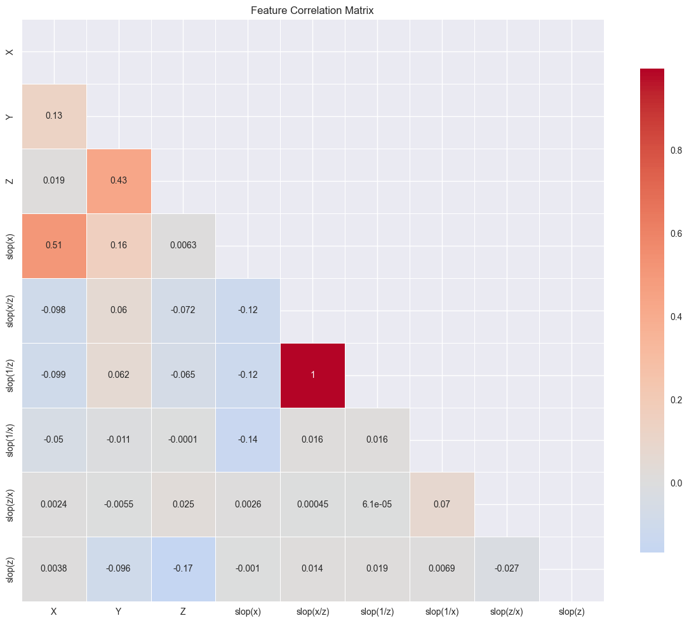
The correlation heatmap shows us the relationship between features
- Most features show weak to moderate correlations, indicating good feature diversity
- `slop(x/z)` and `slop(1/z)` show a correlation of r=1 suggesting that they are redundant

**Feature Distribution Analysis**
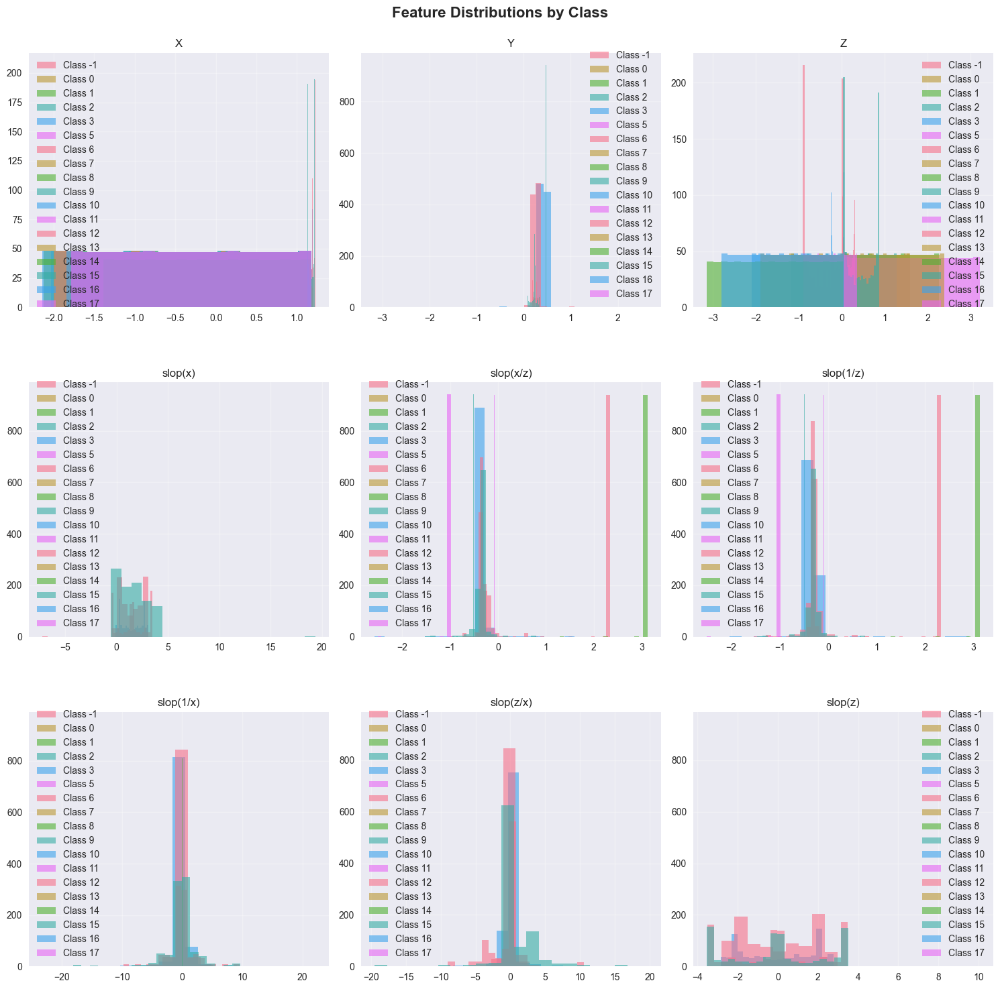

The feature distributions of the X, Y, and Z indicate that for the X and Z directions there is a wide spread motion of the hexapod and for the Y direction the hexapod joints can't move that much. The distributions of the slopes show sharp peaks at different combinations of X and Z positions. This is good because it means that there are some very specific combinations of X and Z positions that indicates a faulty joint. This means models should be able to pick up on these peaks and calssify faulty joints properly. 

**Logistic Regression Model Performance**

The logistic regression model achieved 96% accuracy on the validation set.

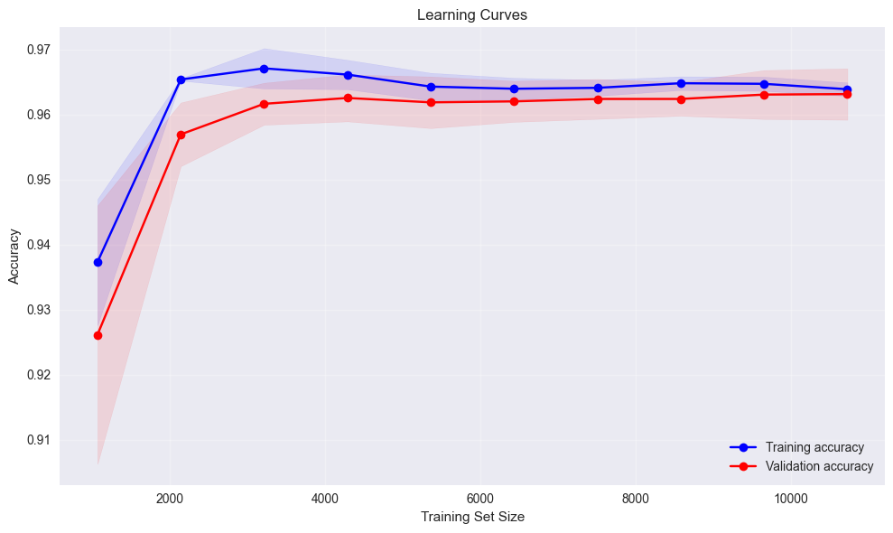
The learning curve shows that the logistic regression model quickly achieves a high performance and then plautaus. The validation accuracy is initially lower than the training accuracy, but the validation accuracy converges to the training accuracy indicating the model isn't overfitting.

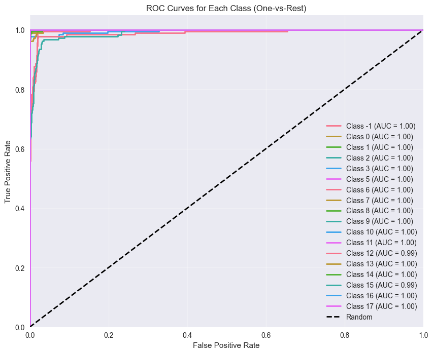

Logistic Regression achieves near-perfect AUC scores of 1 for most classes indicating it is easily able to distringuish different fault types
The learning curves show that the model converges very quickly with high testing and validation accuracy (~96.5 and ~96.2 respectively)

**K Means Clustering Performance**

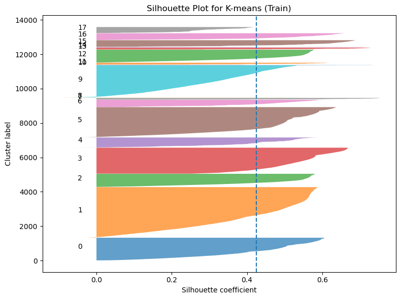

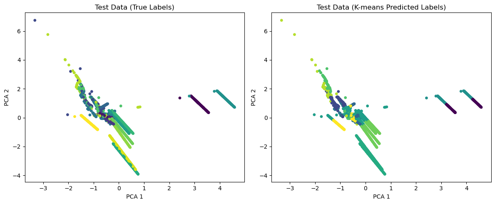

**SVM Model Performance**

The SVM achieved an accuracy of 96% on the validation set

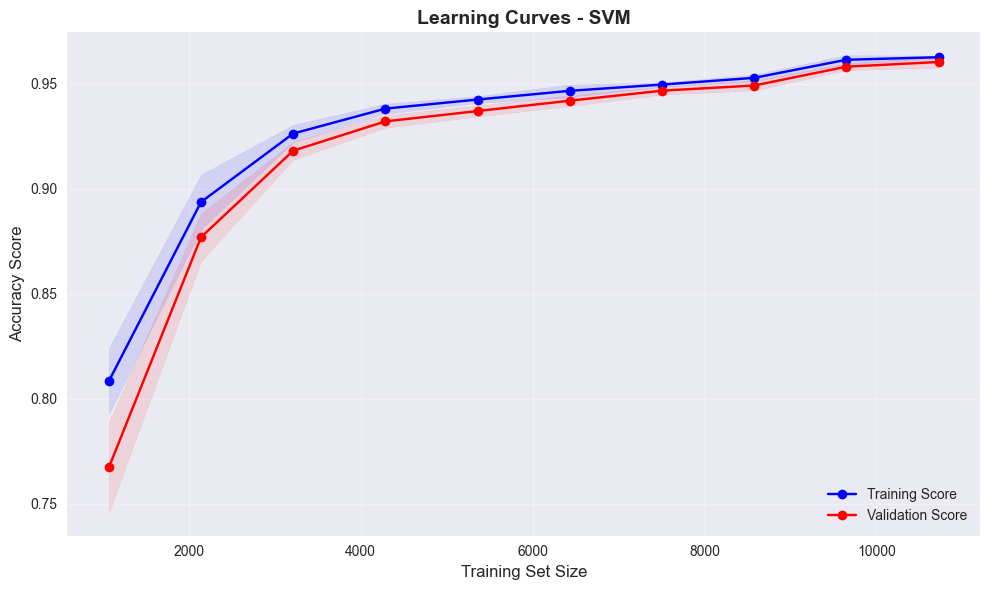
The learning curves show the model's performance on the training and validation set as it trains. This helps us know if the model is overfitting or underfitting. Since the gap between the accuracy of the validation set and the training set is small, this indicates that the model is generalizing well to the unseen data and is not overfitting or underfitting. 

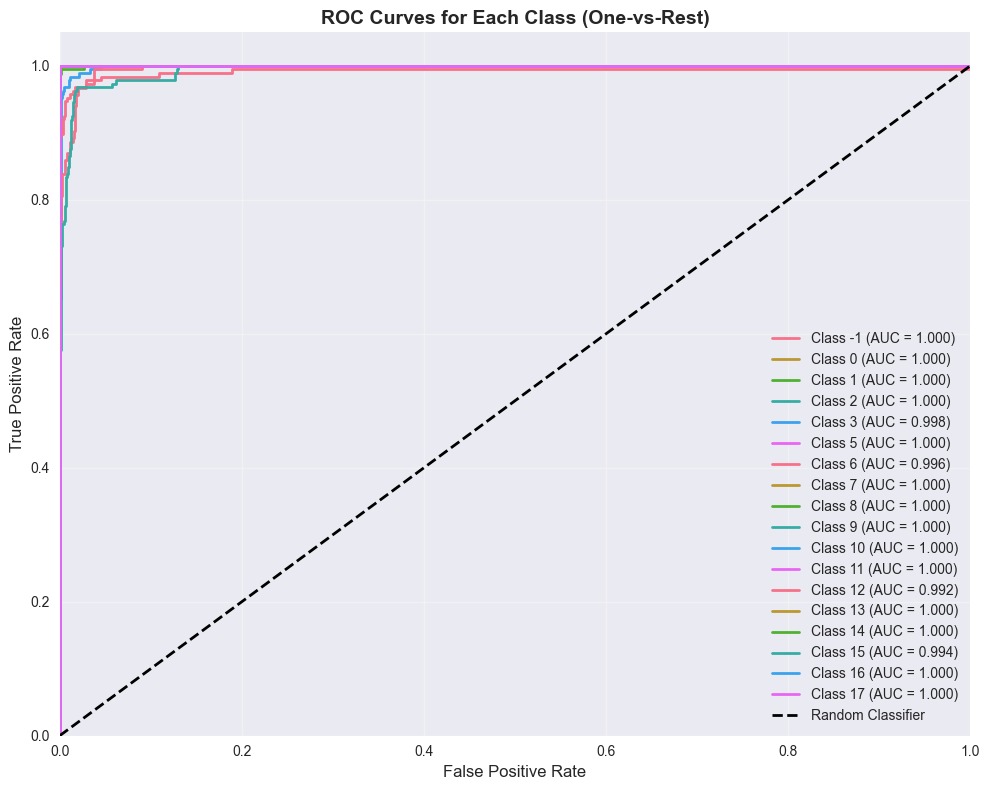
The ROC curves show the trade off between the True positive rate an the false positive rate. The closer the curves are to the top left and the higher the area under the curve (AUC), the better. The dotted line shows the auc curve for random guessing. The AUC for all the curves is between 0.99-1.00 which indicates the model has a strong ability to separate each fault class from the others.

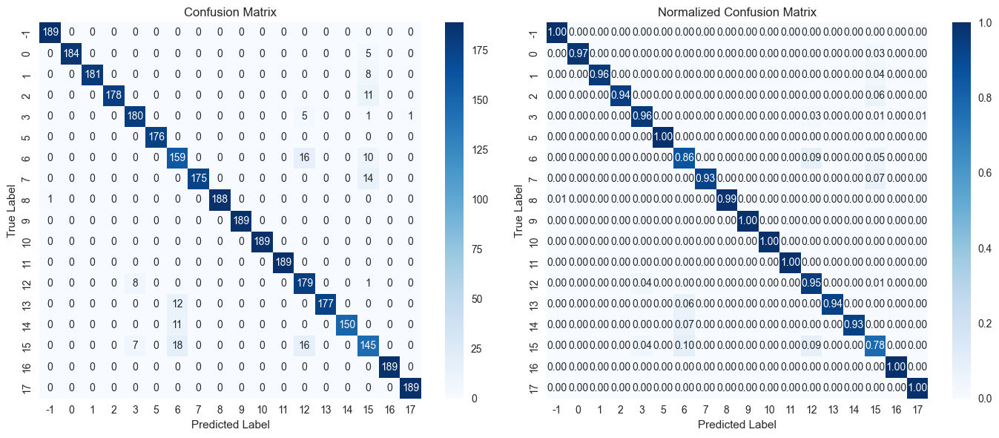
The confusion matricies show that many of the model predictions are the same as the true labels for the joint failures. This indicates strong performance from the SVM with some rare misclassifications. 

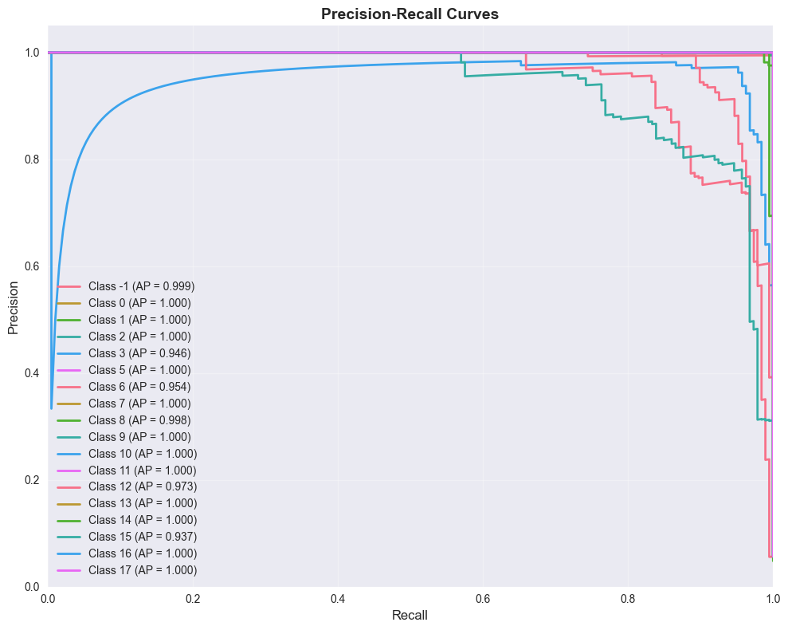
Precision indicates how many items the model identified as positive that were actually positive while recall measures how many of the actual positive items the model correctly identified. The closer the curves are to the top right of the graph, the better. This indicates a great balance betweeen precision and recall where there are few false positives and actual faults. 

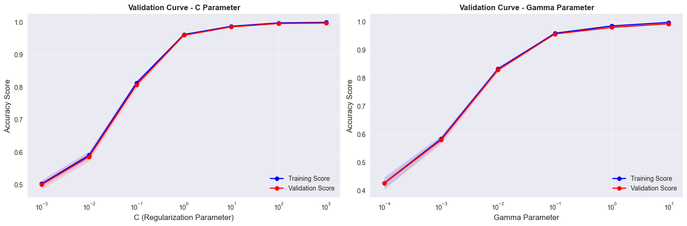
The validation curves show how changing the C and Gamma hyperparameters affects the model's performance. C controls the trade off between a smooth decision boundary and classification accuracy while gamma controls how far the influence of a single training example reaches. A lower C indicates a simpler model while a higher C indicates a more complex model. These graphs show performance plataeus at high C indicating we are not overfitting and optimal performance from C = 1 to C = 10. For Gamma we also see a wide range of acceptable values from 10^-2 to 10^0, while the performance drops at extremely high and low values of Gamma. We chose to use gamma="scale" which automatically tunes the value of gamma based on the features.

### Model Comparison

### Next Steps
For this project we would like to explore some of the more advanced models that were used in the literature to get higher than 96% accuracy on hexapod joint fault detection. Some of these models include neural networks and Two-States Random Forests (or other Random Forest variations). We believe these models would be able to achieve a higher accuracy. We would also like the augment the data from this dataset with more data from other datasets and also with simulated data from Georgia Tech's Robotarium. We believe adding a variety of data will require the models to generalize better allowing them to better detect faults in a wider array of situations. 

### Directory Structure
/src/Data Cleaning.py: This file was used to clean the data by removing outliers and scaling it properly
/src/K_means_vis.ipynb: This notebook was used to generate the analytics and visualizations for the K means clustering model
/src/K_means.py: This file was used to create and train the K means model
/src/model_1.ipynb: This notebook was used to do exploratory data analysis and generate visualizations for the logisitic regression model
/src/Model.py: This file was used to create and train the logistic regression model
/src/svm_vis.ipynb: This notebook was used to generate visualizations for the svm
/src/svm.py: This file was used to create and train the SVM model
/src/Hexapod_One_Joint.csv: This is the raw data from Kaggle in csv format
/src/hexapod_data_cleaned.csv: This the cleaned data stored in csv format
*.png: These are the saved visualizations for the report

## References

[1]Q. Fang, Y. Men, K. Zhang, M. Yu, and Y. Liu, “Real-Time Joint Fault Detection and Diagnosis of Hexapod Robot Based on Improved Random Forest,” Processes, vol. 13, no. 9, pp. 2762–2762, Aug. 2025, doi: https://doi.org/10.3390/pr13092762.

[2]M. Hu, J. Wu, J. Yang, L. Zhang, and F. Yang, “Fault diagnosis of robot joint based on BP neural network,” Robotica, vol. 40, no. 12, pp. 4388–4404, Jul. 2022, doi: https://doi.org/10.1017/s0263574722000984.

[3]S. Raouf, “Fault Detection in Hexapod Robot Joints(One Joint),” Kaggle.com, 2024. https://www.kaggle.com/datasets/samehraouf/fault-detection-in-hexapod-robot-joints-dataset/data (accessed Oct. 03, 2025).

[4]“Robotarium,” Gatech.edu, 2025. https://www.robotarium.gatech.edu/ (accessed Oct. 03, 2025).

[5]"MuJoCo," DeepMind Technologies Limited, 2025. https://mujoco.org/ (accessed Oct. 03, 2025).

## Gantt Chart

<pre class="mermaid">
gantt
    title Hexapod Fault Detection
    dateFormat  YYYY-MM-DD
    axisFormat  %b %d

    section Project Proposal
    Introduction & Background        :active, a1, 2025-09-27, 6d
    Problem Definition               :active, a2, 2025-09-27, 6d
    Methods                          :active, a3, 2025-09-27, 6d
    Potential Results & Discussion   :active, a4, 2025-09-27, 6d
    Video Recording                  :active, a5, 2025-09-27, 6d
    GitHub Page                      :active, a6, 2025-09-27, 6d

    section Model 1
    Data Sourcing and Cleaning (M1)  :a7, 2025-10-07, 30d
    Model Selection (M1)             :a8, 2025-10-07, 30d
    Data Pre-Processing (M1)         :a9, 2025-10-07, 30d
    Model Coding (M1)                :a10, 2025-10-07, 30d
    Results Evaluation (M1)          :a11, 2025-10-07, 30d
    Midterm Report                   :a12, 2025-10-07, 30d

    section Model 2
    Data Sourcing and Cleaning (M2)  :b1, 2025-10-07, 30d
    Model Selection (M2)             :b2, 2025-10-07, 30d
    Data Pre-Processing (M2)         :b3, 2025-10-07, 30d
    Model Coding (M2)                :b4, 2025-10-07, 30d
    Results Evaluation (M2)          :b5, 2025-10-07, 30d

    section Model 3
    Data Sourcing and Cleaning (M3)  :c1, 2025-11-07, 25d
    Model Selection (M3)             :c2, 2025-11-07, 25d
    Data Pre-Processing (M3)         :c3, 2025-11-07, 25d
    Model Coding (M3)                :c4, 2025-11-07, 25d
    Results Evaluation (M3)          :c5, 2025-11-07, 25d

    section Evaluation and Final
    Model Comparison                 :done, d1, 2025-11-07, 25d
    Presentation                     :done, d2, 2025-11-07, 25d
    Recording                        :done, d3, 2025-11-07, 25d
    Final Report                     :done, d4, 2025-11-07, 25d
</pre>

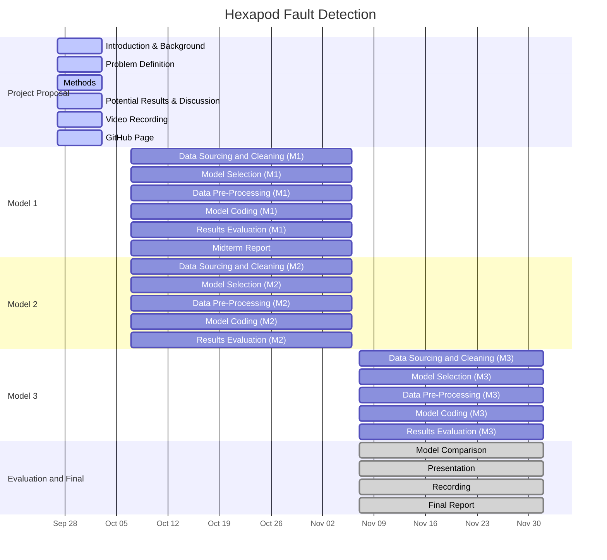

## Contribution Table

| Team Member | Contribution |
|-------------|--------------|
| Shreyas | Final report intro & problem definition • Recording: intro & problem definition • Gantt Chart |
| Tyler | Final report methods & results • Recording: ML algorithms & results/discussion • GitHub setup |
| Eshaan | Slides creation & summarization • Recording: Dataset & data processing • Uploaded/edited video  |
