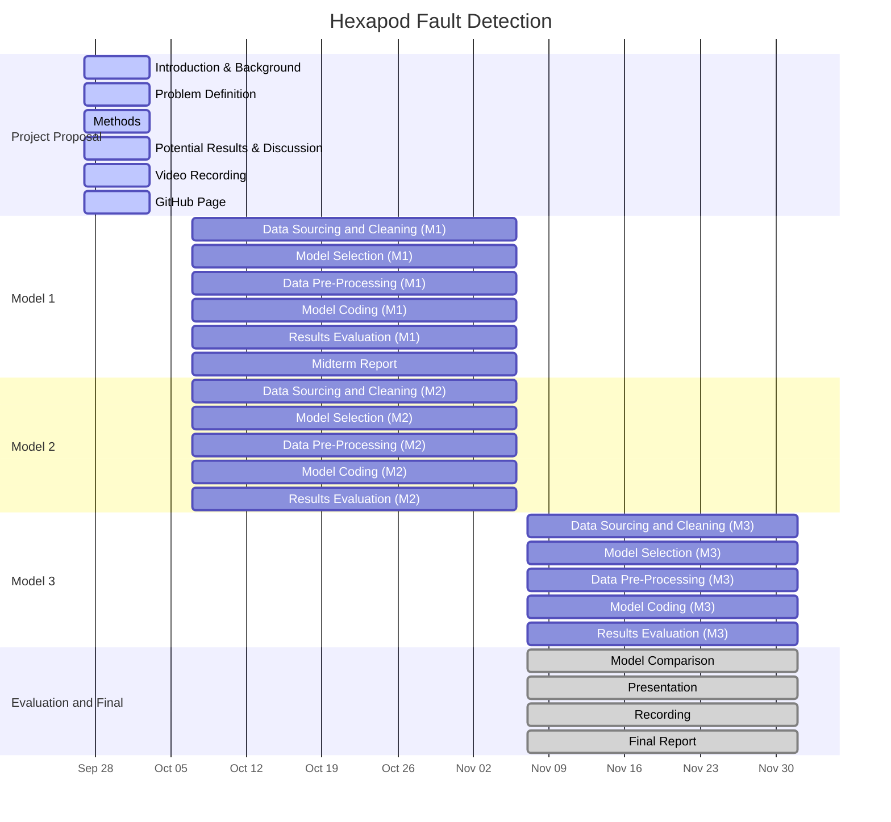

# ML4641_Robotics_Project

Dataset:
https://www.kaggle.com/datasets/samehraouf/fault-detection-in-hexapod-robot-joints-dataset/data

## Introduction

Robotic systems must maintain high reliability and safety. Joint or actuator failures in robotics cause great disruptions, and detecting, classifying, and isolating faults in robotic subsystems in real time is critical. Fault detection and diagnosis (FDD) in robotics has been studied from model-based and data-driven perspectives. In model-based approaches, observers, parity checks, and residual generation techniques detect deviation from expected dynamics. In data-driven approaches, sensor and control signals are classified or regressed by machine learning models.

### Dataset

We will use the "Fault Detection in Hexapod Robot Joints” dataset from Kaggle [3]. This dataset provides time-series readings from hexapod robot joints under various fault conditions including offset error, gain error, and combined faults. Features include pose and slopes defined by different axes. The dataset is labeled by fault class making it supervised. We aim to augment this dataset with MuJoCo Simulations and Georgia Tech’s Robotarium creating similar conditions to the ones in the Hexapod Robot Joints [4, 5].

### Background

Recent data-driven robotic optimization works include Two-States Random Forest (TSRF) algorithm applied to hexapod robot join fault detection [1]. By layering two random forest classifiers and using class-probability vectors from the first stage as meta-features for the second, they claim 99.7% accuracy over baseline random forest models. Another approach applied backpropagation neural networks to robotic fault diagnosis, exploring how different error magnitudes and sampling frequencies influence accuracy [2]. They report a diagnostic accuracy of up to 99.17% in simulation.

## Problem Definition

From these works, several themes emerge. First, faults often include constant offset, gain error, stuck or drift behavior in sensors or actuators, and occasional abrupt failures. Second, real-world systems have measurement noise, so robustness is critical. Third, distinguishing which joint or subsystem is faulty (sensor vs. actuator) is harder than simple fault detection.

Given sensor and actuator readings from hexapod robot joints, the goal is detecting and classifying faults. We plan to benchmark several models, compare their performance, and analyze feature importance, misclassifications, and robustness to noise.

We’re tackling this due to its practical relevance, extensions to other research fields, and potential novelty. Fault detection in robotic joints is crucial for maintaining uptime, safety, and reliability. Even subtle faults (sensor drift or gain error) degrade performance. The hexapod is suitable for testing with multiple joints. Analyzing this dataset might show certain features and methods yield better diagnostic accuracy providing novel, generalizable insights into fault detection.

## Methods

### Data Preprocessing:

We will first find data points with poses or slopes drastically different from most other points in the dataset through RANSAC. This runs until the line with the most inliers is found, discarding all outliers. We may use PyTorch’s torch-ransac3d, which performs data-cleaning. To fill in missing gaps and ensure a smooth dataset, we will use linear regression or K-nearest neighbors based on poses and slopes present ensuring the data accounts for all possibilities during robot function. For effective data analysis, we will normalize the pose data of the robot to generate a baseline for the robot when it no longer relies on our supervised dataset.

### ML Algorithms:

We will use supervised learning due to possessing data labeled with respect to the number of joint faults that have occurred in the pose transformation. To effectively analyze pose and slope data, we will use logistic regression to determine feature combinations resulting in faulty joints and ones more conducive to the robot’s design. Logistic regression will be done through PyTorch’s torch.nn.Module.

When we transition the model to the simulation we won’t use supervised learning as the data generated here will be unlabeled. Therefore, when transitioning past the original dataset we’ll use K-means or other unsupervised learning to ensure the model functions correctly based on new pose and slope estimates. Our simulations will run through MuJoCo, and K-means will run using PyTorch’s torch_kmeans.

The algorithms chosen for simulations should have lower computational requirements and time complexity due to robotic computing constraints.

## Results:

### Quantitative Metrics:

To quantify our ML techniques, we will use various loss and scoring functions. When working with logistic regression, we will use Log Loss as our loss function which is intended for logistic regression algorithms, and will also use Area Under the ROC Curve (AUC). When working with Linear Regression throughout our project, we will use Mean Squared Error (MSE) to quantify how error-prone our Linear Regressions were. When working with K-means, we will utilize Silhouette Analysis to determine whether points fall close to their respective clusters.

### Project Goals and Expected Results:

With this project, we expect to minimize or eliminate joint failures ensuring robots may cooperate with fragile beings and objects. With the mass proliferation of robots, it is crucial projects put forth ensure robots remain safe for use by average laypeople, and failing this will result in unintended and unnecessary consequences. Our project intends to promote sustainable and ethical use of robotics, and if successful may contribute greatly to reducing robotics-related injuries.

## References

[1]Q. Fang, Y. Men, K. Zhang, M. Yu, and Y. Liu, “Real-Time Joint Fault Detection and Diagnosis of Hexapod Robot Based on Improved Random Forest,” Processes, vol. 13, no. 9, pp. 2762–2762, Aug. 2025, doi: https://doi.org/10.3390/pr13092762.

[2]M. Hu, J. Wu, J. Yang, L. Zhang, and F. Yang, “Fault diagnosis of robot joint based on BP neural network,” Robotica, vol. 40, no. 12, pp. 4388–4404, Jul. 2022, doi: https://doi.org/10.1017/s0263574722000984.

[3]S. Raouf, “Fault Detection in Hexapod Robot Joints(One Joint),” Kaggle.com, 2024. https://www.kaggle.com/datasets/samehraouf/fault-detection-in-hexapod-robot-joints-dataset/data (accessed Oct. 03, 2025).

[4]“Robotarium,” Gatech.edu, 2025. https://www.robotarium.gatech.edu/ (accessed Oct. 03, 2025).

[5]"MuJoCo," DeepMind Technologies Limited, 2025. https://mujoco.org/ (accessed Oct. 03, 2025).

## Gantt Chart
<pre class="mermaid">
gantt
    title Hexapod Fault Detection
    dateFormat  YYYY-MM-DD
    axisFormat  %b %d

    section Project Proposal
    Introduction & Background        :active, a1, 2025-09-27, 6d
    Problem Definition               :active, a2, 2025-09-27, 6d
    Methods                          :active, a3, 2025-09-27, 6d
    Potential Results & Discussion   :active, a4, 2025-09-27, 6d
    Video Recording                  :active, a5, 2025-09-27, 6d
    GitHub Page                      :active, a6, 2025-09-27, 6d

    section Model 1
    Data Sourcing and Cleaning (M1)  :a7, 2025-10-07, 30d
    Model Selection (M1)             :a8, 2025-10-07, 30d
    Data Pre-Processing (M1)         :a9, 2025-10-07, 30d
    Model Coding (M1)                :a10, 2025-10-07, 30d
    Results Evaluation (M1)          :a11, 2025-10-07, 30d
    Midterm Report                   :a12, 2025-10-07, 30d

    section Model 2
    Data Sourcing and Cleaning (M2)  :b1, 2025-10-07, 30d
    Model Selection (M2)             :b2, 2025-10-07, 30d
    Data Pre-Processing (M2)         :b3, 2025-10-07, 30d
    Model Coding (M2)                :b4, 2025-10-07, 30d
    Results Evaluation (M2)          :b5, 2025-10-07, 30d

    section Model 3
    Data Sourcing and Cleaning (M3)  :c1, 2025-11-07, 25d
    Model Selection (M3)             :c2, 2025-11-07, 25d
    Data Pre-Processing (M3)         :c3, 2025-11-07, 25d
    Model Coding (M3)                :c4, 2025-11-07, 25d
    Results Evaluation (M3)          :c5, 2025-11-07, 25d

    section Evaluation and Final
    Model Comparison                 :done, d1, 2025-11-07, 25d
    Presentation                     :done, d2, 2025-11-07, 25d
    Recording                        :done, d3, 2025-11-07, 25d
    Final Report                     :done, d4, 2025-11-07, 25d
</pre>

## Contribution Table

| Team Member | Contribution |
|-------------|--------------|
| Shreyas | Final report intro & problem definition • Recording: intro & problem definition • Gantt Chart |
| Tyler | Final report methods & results • Recording: ML algorithms & results/discussion • GitHub setup |
| Eshaan | Slides creation & summarization • Recording: Dataset & data processing • Uploaded/edtited video  |
